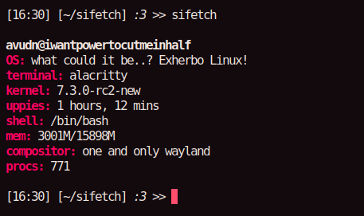

# sifetch

sifetch is a little fetch program written in C. I decided to use it to test my skills basically, and I'm going to update it whenever I have enough knowledge for it.

# Build

To build and install it, go to src/ directory and run: <br>
```bash
make
doas make install
```
# Customization
For customization, you can see the ```config.h``` file. <br>
You can adjust hide_term, and logos_enable variables there.

# Preview


# Currently supported logos:
Arch Linux <br>
Exherbo Linux <br>
Gentoo Linux <br>
